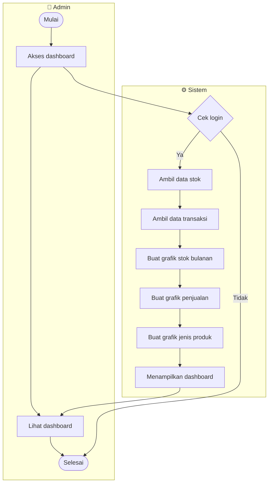

# Activity Diagram - Dashboard

```mermaid
flowchart TD
    subgraph Admin["👤 Admin"]
        Start([Mulai]) --> AksesDashboard[Akses dashboard]
        AksesDashboard --> LihatDashboard[Lihat dashboard]
        LihatDashboard --> End([Selesai])
    end
    
    subgraph System["⚙️ Sistem"]
        CekLogin{Cek login}
        AmbilDataStok[Ambil data stok]
        AmbilDataTransaksi[Ambil data transaksi]
        BuatGrafikStok[Buat grafik stok bulanan]
        BuatGrafikPenjualan[Buat grafik penjualan]
        BuatGrafikProduk[Buat grafik jenis produk]
        TampilDashboard[Menampilkan dashboard]
    end
    
    AksesDashboard --> CekLogin
    CekLogin -->|Tidak| End
    CekLogin -->|Ya| AmbilDataStok
    AmbilDataStok --> AmbilDataTransaksi
    AmbilDataTransaksi --> BuatGrafikStok
    BuatGrafikStok --> BuatGrafikPenjualan
    BuatGrafikPenjualan --> BuatGrafikProduk
    BuatGrafikProduk --> TampilDashboard
    TampilDashboard --> LihatDashboard
```

