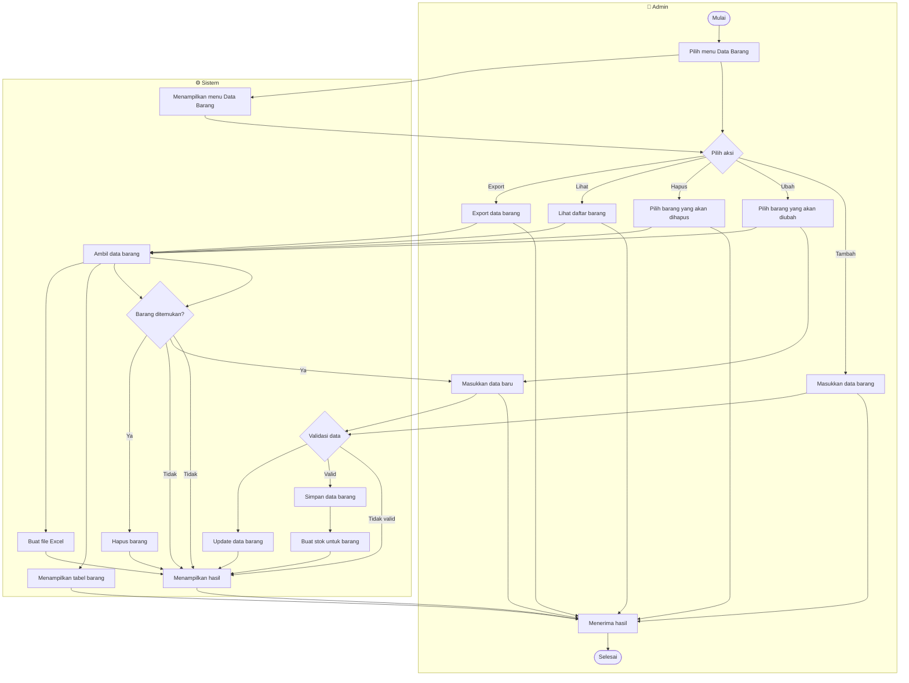

# Activity Diagram - Data Barang

```mermaid
flowchart TD
    subgraph Admin["👤 Admin"]
        Start([Mulai]) --> PilihMenu[Pilih menu Data Barang]
        PilihMenu --> PilihAksi{Pilih aksi}
        PilihAksi -->|Tambah| InputData[Masukkan data barang]
        PilihAksi -->|Ubah| PilihUbah[Pilih barang yang akan diubah]
        PilihAksi -->|Hapus| PilihHapus[Pilih barang yang akan dihapus]
        PilihAksi -->|Lihat| LihatData[Lihat daftar barang]
        PilihAksi -->|Export| ExportData[Export data barang]
        InputData --> TerimaHasil[Menerima hasil]
        PilihUbah --> InputUbah[Masukkan data baru]
        InputUbah --> TerimaHasil
        PilihHapus --> TerimaHasil
        LihatData --> TerimaHasil
        ExportData --> TerimaHasil
        TerimaHasil --> End([Selesai])
    end
    
    subgraph System["⚙️ Sistem"]
        TampilMenu[Menampilkan menu Data Barang]
        CekData{Validasi data}
        SimpanData[Simpan data barang]
        BuatStok[Buat stok untuk barang]
        AmbilData[Ambil data barang]
        CekAda{Barang ditemukan?}
        UpdateData[Update data barang]
        HapusData[Hapus barang]
        TampilTabel[Menampilkan tabel barang]
        BuatExcel[Buat file Excel]
        TampilHasil[Menampilkan hasil]
    end
    
    PilihMenu --> TampilMenu
    TampilMenu --> PilihAksi
    InputData --> CekData
    CekData -->|Tidak valid| TampilHasil
    CekData -->|Valid| SimpanData
    SimpanData --> BuatStok
    BuatStok --> TampilHasil
    PilihUbah --> AmbilData
    AmbilData --> CekAda
    CekAda -->|Tidak| TampilHasil
    CekAda -->|Ya| InputUbah
    InputUbah --> CekData
    CekData --> UpdateData
    UpdateData --> TampilHasil
    PilihHapus --> AmbilData
    AmbilData --> CekAda
    CekAda -->|Tidak| TampilHasil
    CekAda -->|Ya| HapusData
    HapusData --> TampilHasil
    LihatData --> AmbilData
    AmbilData --> TampilTabel
    TampilTabel --> TerimaHasil
    ExportData --> AmbilData
    AmbilData --> BuatExcel
    BuatExcel --> TampilHasil
    TampilHasil --> TerimaHasil
```
