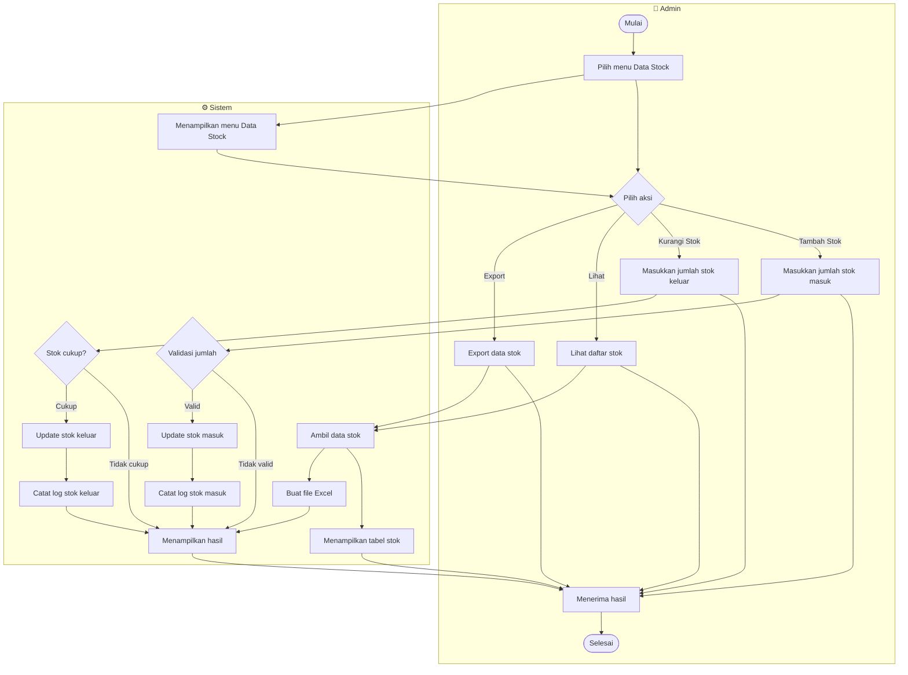

# Activity Diagram - Data Stock

```mermaid
flowchart TD
    subgraph Admin["👤 Admin"]
        Start([Mulai]) --> PilihMenu[Pilih menu Data Stock]
        PilihMenu --> PilihAksi{Pilih aksi}
        PilihAksi -->|Tambah Stok| InputTambah[Masukkan jumlah stok masuk]
        PilihAksi -->|Kurangi Stok| InputKurangi[Masukkan jumlah stok keluar]
        PilihAksi -->|Lihat| LihatData[Lihat daftar stok]
        PilihAksi -->|Export| ExportData[Export data stok]
        InputTambah --> TerimaHasil[Menerima hasil]
        InputKurangi --> TerimaHasil
        LihatData --> TerimaHasil
        ExportData --> TerimaHasil
        TerimaHasil --> End([Selesai])
    end
    
    subgraph System["⚙️ Sistem"]
        TampilMenu[Menampilkan menu Data Stock]
        CekJumlah{Validasi jumlah}
        UpdateStokMasuk[Update stok masuk]
        CatatLogMasuk[Catat log stok masuk]
        CekStok{Stok cukup?}
        UpdateStokKeluar[Update stok keluar]
        CatatLogKeluar[Catat log stok keluar]
        AmbilData[Ambil data stok]
        TampilTabel[Menampilkan tabel stok]
        BuatExcel[Buat file Excel]
        TampilHasil[Menampilkan hasil]
    end
    
    PilihMenu --> TampilMenu
    TampilMenu --> PilihAksi
    InputTambah --> CekJumlah
    CekJumlah -->|Tidak valid| TampilHasil
    CekJumlah -->|Valid| UpdateStokMasuk
    UpdateStokMasuk --> CatatLogMasuk
    CatatLogMasuk --> TampilHasil
    InputKurangi --> CekStok
    CekStok -->|Tidak cukup| TampilHasil
    CekStok -->|Cukup| UpdateStokKeluar
    UpdateStokKeluar --> CatatLogKeluar
    CatatLogKeluar --> TampilHasil
    LihatData --> AmbilData
    AmbilData --> TampilTabel
    TampilTabel --> TerimaHasil
    ExportData --> AmbilData
    AmbilData --> BuatExcel
    BuatExcel --> TampilHasil
    TampilHasil --> TerimaHasil
```
