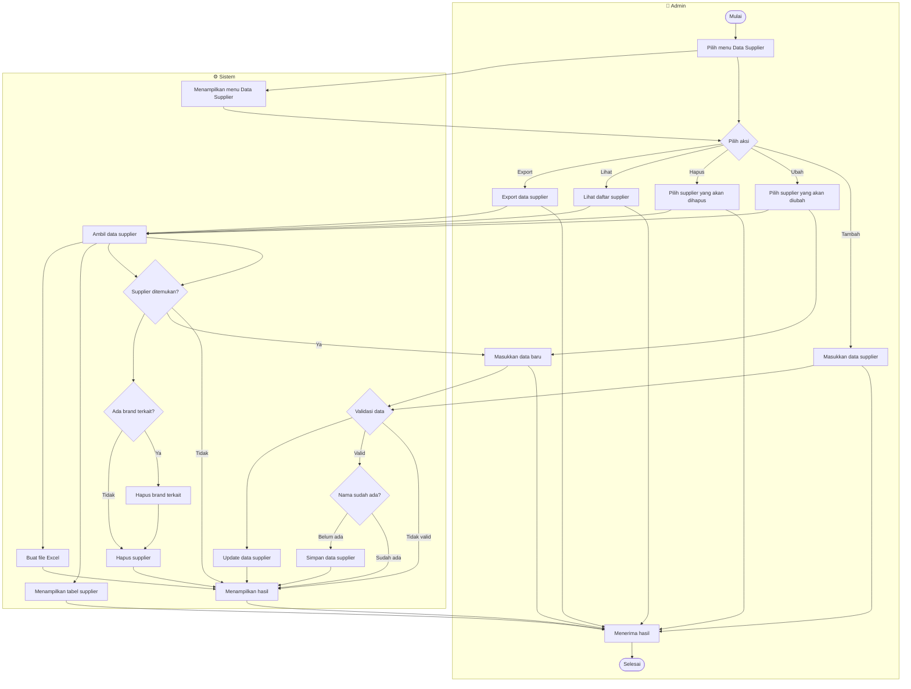

# Activity Diagram - Data Supplier

```mermaid
flowchart TD
    subgraph Admin["👤 Admin"]
        Start([Mulai]) --> PilihMenu[Pilih menu Data Supplier]
        PilihMenu --> PilihAksi{Pilih aksi}
        PilihAksi -->|Tambah| InputData[Masukkan data supplier]
        PilihAksi -->|Ubah| PilihUbah[Pilih supplier yang akan diubah]
        PilihAksi -->|Hapus| PilihHapus[Pilih supplier yang akan dihapus]
        PilihAksi -->|Lihat| LihatData[Lihat daftar supplier]
        PilihAksi -->|Export| ExportData[Export data supplier]
        InputData --> TerimaHasil[Menerima hasil]
        PilihUbah --> InputUbah[Masukkan data baru]
        InputUbah --> TerimaHasil
        PilihHapus --> TerimaHasil
        LihatData --> TerimaHasil
        ExportData --> TerimaHasil
        TerimaHasil --> End([Selesai])
    end
    
    subgraph System["⚙️ Sistem"]
        TampilMenu[Menampilkan menu Data Supplier]
        CekData{Validasi data}
        CekNama{Nama sudah ada?}
        SimpanData[Simpan data supplier]
        AmbilData[Ambil data supplier]
        CekAda{Supplier ditemukan?}
        UpdateData[Update data supplier]
        CekBrand{Ada brand terkait?}
        HapusBrand[Hapus brand terkait]
        HapusData[Hapus supplier]
        TampilTabel[Menampilkan tabel supplier]
        BuatExcel[Buat file Excel]
        TampilHasil[Menampilkan hasil]
    end
    
    PilihMenu --> TampilMenu
    TampilMenu --> PilihAksi
    InputData --> CekData
    CekData -->|Tidak valid| TampilHasil
    CekData -->|Valid| CekNama
    CekNama -->|Sudah ada| TampilHasil
    CekNama -->|Belum ada| SimpanData
    SimpanData --> TampilHasil
    PilihUbah --> AmbilData
    AmbilData --> CekAda
    CekAda -->|Tidak| TampilHasil
    CekAda -->|Ya| InputUbah
    InputUbah --> CekData
    CekData --> UpdateData
    UpdateData --> TampilHasil
    PilihHapus --> AmbilData
    AmbilData --> CekAda
    CekAda --> CekBrand
    CekBrand -->|Ya| HapusBrand
    HapusBrand --> HapusData
    CekBrand -->|Tidak| HapusData
    HapusData --> TampilHasil
    LihatData --> AmbilData
    AmbilData --> TampilTabel
    TampilTabel --> TerimaHasil
    ExportData --> AmbilData
    AmbilData --> BuatExcel
    BuatExcel --> TampilHasil
    TampilHasil --> TerimaHasil
```
