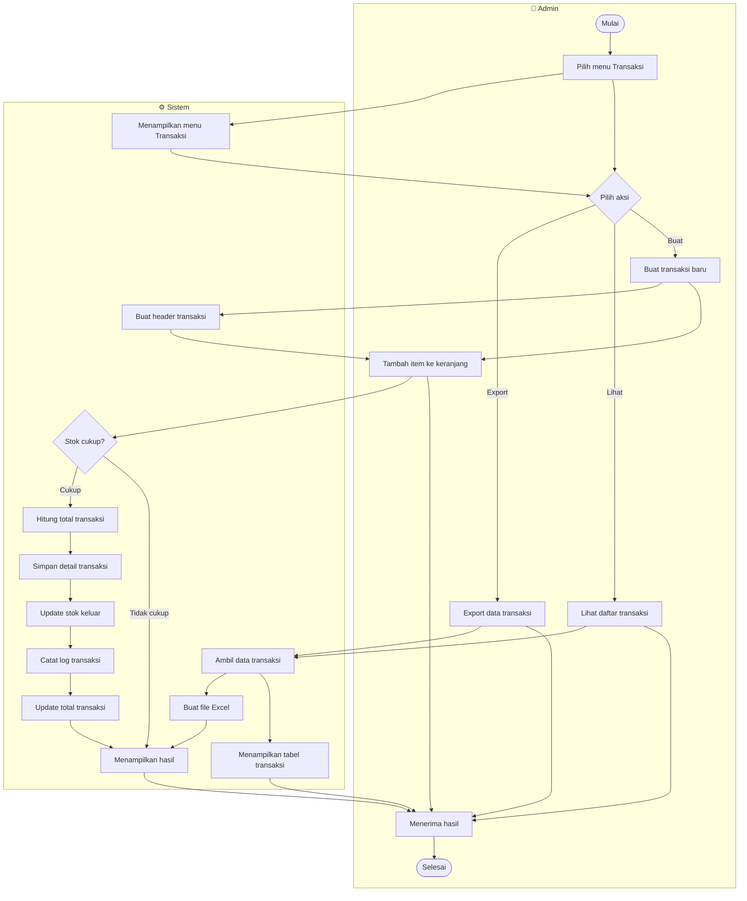

# Activity Diagram - Data Transaksi Penjualan

```mermaid
flowchart TD
    subgraph Admin["👤 Admin"]
        Start([Mulai]) --> PilihMenu[Pilih menu Transaksi]
        PilihMenu --> PilihAksi{Pilih aksi}
        PilihAksi -->|Buat| BuatTransaksi[Buat transaksi baru]
        PilihAksi -->|Lihat| LihatData[Lihat daftar transaksi]
        PilihAksi -->|Export| ExportData[Export data transaksi]
        BuatTransaksi --> TambahItem[Tambah item ke keranjang]
        TambahItem --> TerimaHasil[Menerima hasil]
        LihatData --> TerimaHasil
        ExportData --> TerimaHasil
        TerimaHasil --> End([Selesai])
    end
    
    subgraph System["⚙️ Sistem"]
        TampilMenu[Menampilkan menu Transaksi]
        BuatHeader[Buat header transaksi]
        CekStok{Stok cukup?}
        HitungTotal[Hitung total transaksi]
        SimpanDetail[Simpan detail transaksi]
        UpdateStok[Update stok keluar]
        CatatLog[Catat log transaksi]
        UpdateTotal[Update total transaksi]
        AmbilData[Ambil data transaksi]
        TampilTabel[Menampilkan tabel transaksi]
        BuatExcel[Buat file Excel]
        TampilHasil[Menampilkan hasil]
    end
    
    PilihMenu --> TampilMenu
    TampilMenu --> PilihAksi
    BuatTransaksi --> BuatHeader
    BuatHeader --> TambahItem
    TambahItem --> CekStok
    CekStok -->|Tidak cukup| TampilHasil
    CekStok -->|Cukup| HitungTotal
    HitungTotal --> SimpanDetail
    SimpanDetail --> UpdateStok
    UpdateStok --> CatatLog
    CatatLog --> UpdateTotal
    UpdateTotal --> TampilHasil
    LihatData --> AmbilData
    AmbilData --> TampilTabel
    TampilTabel --> TerimaHasil
    ExportData --> AmbilData
    AmbilData --> BuatExcel
    BuatExcel --> TampilHasil
    TampilHasil --> TerimaHasil
```
