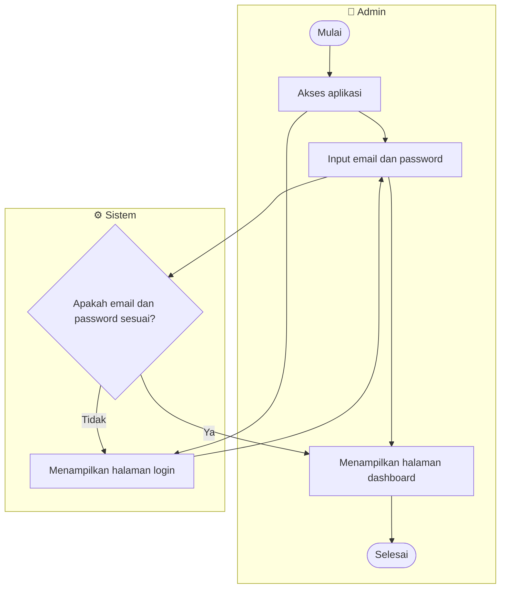

# Activity Diagram - Login

```mermaid
flowchart TD
    subgraph Admin["👤 Admin"]
        Start([Mulai]) --> AksesAplikasi[Akses aplikasi]
        AksesAplikasi --> InputData[Input email dan password]
        InputData --> TampilDashboard
        TampilDashboard --> End([Selesai])
    end
    
    subgraph System["⚙️ Sistem"]
        TampilLogin[Menampilkan halaman login]
        CekLogin{Apakah email dan password sesuai?}
        TampilDashboard[Menampilkan halaman dashboard]
    end
    
    AksesAplikasi --> TampilLogin
    TampilLogin --> InputData
    InputData --> CekLogin
    CekLogin -->|Tidak| TampilLogin
    CekLogin -->|Ya| TampilDashboard
```

