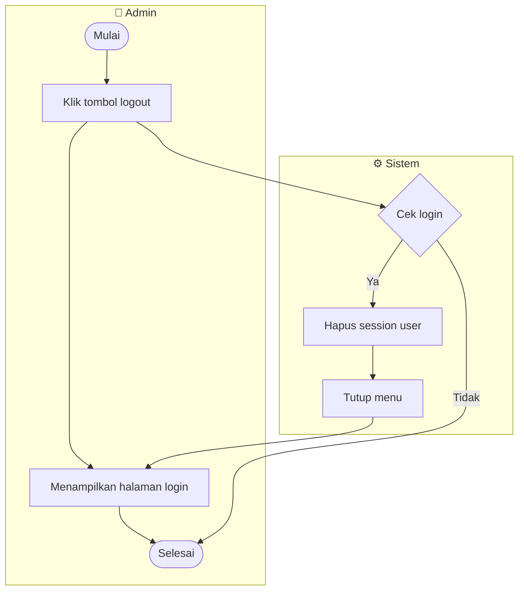

# Activity Diagram - Logout

```mermaid
flowchart TD
    subgraph Admin["👤 Admin"]
        Start([Mulai]) --> KlikLogout[Klik tombol logout]
        KlikLogout --> TampilLogin[Menampilkan halaman login]
        TampilLogin --> End([Selesai])
    end
    
    subgraph System["⚙️ Sistem"]
        CekLogin{Cek login}
        HapusSession[Hapus session user]
        TutupMenu[Tutup menu]
    end
    
    KlikLogout --> CekLogin
    CekLogin -->|Tidak| End
    CekLogin -->|Ya| HapusSession
    HapusSession --> TutupMenu
    TutupMenu --> TampilLogin
```
