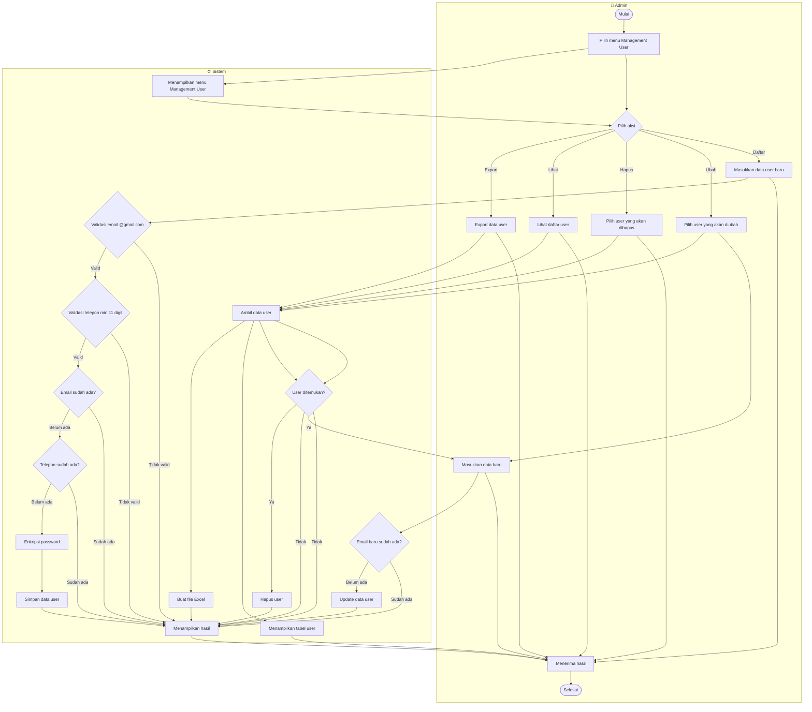

# Activity Diagram - Management User

```mermaid
flowchart TD
    subgraph Admin["👤 Admin"]
        Start([Mulai]) --> PilihMenu[Pilih menu Management User]
        PilihMenu --> PilihAksi{Pilih aksi}
        PilihAksi -->|Daftar| InputData[Masukkan data user baru]
        PilihAksi -->|Ubah| PilihUbah[Pilih user yang akan diubah]
        PilihAksi -->|Hapus| PilihHapus[Pilih user yang akan dihapus]
        PilihAksi -->|Lihat| LihatData[Lihat daftar user]
        PilihAksi -->|Export| ExportData[Export data user]
        InputData --> TerimaHasil[Menerima hasil]
        PilihUbah --> InputUbah[Masukkan data baru]
        InputUbah --> TerimaHasil
        PilihHapus --> TerimaHasil
        LihatData --> TerimaHasil
        ExportData --> TerimaHasil
        TerimaHasil --> End([Selesai])
    end
    
    subgraph System["⚙️ Sistem"]
        TampilMenu[Menampilkan menu Management User]
        CekEmail{Validasi email @gmail.com}
        CekTelepon{Validasi telepon min 11 digit}
        CekEmailAda{Email sudah ada?}
        CekTeleponAda{Telepon sudah ada?}
        EnkripsiPassword[Enkripsi password]
        SimpanData[Simpan data user]
        AmbilData[Ambil data user]
        CekAda{User ditemukan?}
        CekEmailBaru{Email baru sudah ada?}
        UpdateData[Update data user]
        HapusData[Hapus user]
        TampilTabel[Menampilkan tabel user]
        BuatExcel[Buat file Excel]
        TampilHasil[Menampilkan hasil]
    end
    
    PilihMenu --> TampilMenu
    TampilMenu --> PilihAksi
    InputData --> CekEmail
    CekEmail -->|Tidak valid| TampilHasil
    CekEmail -->|Valid| CekTelepon
    CekTelepon -->|Tidak valid| TampilHasil
    CekTelepon -->|Valid| CekEmailAda
    CekEmailAda -->|Sudah ada| TampilHasil
    CekEmailAda -->|Belum ada| CekTeleponAda
    CekTeleponAda -->|Sudah ada| TampilHasil
    CekTeleponAda -->|Belum ada| EnkripsiPassword
    EnkripsiPassword --> SimpanData
    SimpanData --> TampilHasil
    PilihUbah --> AmbilData
    AmbilData --> CekAda
    CekAda -->|Tidak| TampilHasil
    CekAda -->|Ya| InputUbah
    InputUbah --> CekEmailBaru
    CekEmailBaru -->|Sudah ada| TampilHasil
    CekEmailBaru -->|Belum ada| UpdateData
    UpdateData --> TampilHasil
    PilihHapus --> AmbilData
    AmbilData --> CekAda
    CekAda -->|Tidak| TampilHasil
    CekAda -->|Ya| HapusData
    HapusData --> TampilHasil
    LihatData --> AmbilData
    AmbilData --> TampilTabel
    TampilTabel --> TerimaHasil
    ExportData --> AmbilData
    AmbilData --> BuatExcel
    BuatExcel --> TampilHasil
    TampilHasil --> TerimaHasil
```
