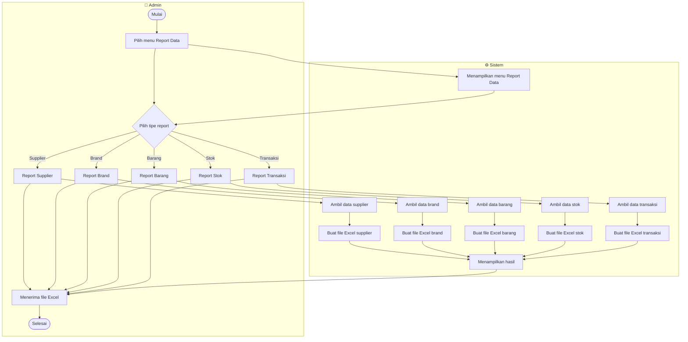

# Activity Diagram - Report Data

```mermaid
flowchart TD
    subgraph Admin["👤 Admin"]
        Start([Mulai]) --> PilihMenu[Pilih menu Report Data]
        PilihMenu --> PilihReport{Pilih tipe report}
        PilihReport -->|Supplier| ReportSupplier[Report Supplier]
        PilihReport -->|Brand| ReportBrand[Report Brand]
        PilihReport -->|Barang| ReportBarang[Report Barang]
        PilihReport -->|Stok| ReportStok[Report Stok]
        PilihReport -->|Transaksi| ReportTransaksi[Report Transaksi]
        ReportSupplier --> TerimaFile[Menerima file Excel]
        ReportBrand --> TerimaFile
        ReportBarang --> TerimaFile
        ReportStok --> TerimaFile
        ReportTransaksi --> TerimaFile
        TerimaFile --> End([Selesai])
    end
    
    subgraph System["⚙️ Sistem"]
        TampilMenu[Menampilkan menu Report Data]
        AmbilDataSupplier[Ambil data supplier]
        BuatExcel1[Buat file Excel supplier]
        AmbilDataBrand[Ambil data brand]
        BuatExcel2[Buat file Excel brand]
        AmbilDataBarang[Ambil data barang]
        BuatExcel3[Buat file Excel barang]
        AmbilDataStok[Ambil data stok]
        BuatExcel4[Buat file Excel stok]
        AmbilDataTransaksi[Ambil data transaksi]
        BuatExcel5[Buat file Excel transaksi]
        TampilHasil[Menampilkan hasil]
    end
    
    PilihMenu --> TampilMenu
    TampilMenu --> PilihReport
    ReportSupplier --> AmbilDataSupplier
    AmbilDataSupplier --> BuatExcel1
    BuatExcel1 --> TampilHasil
    ReportBrand --> AmbilDataBrand
    AmbilDataBrand --> BuatExcel2
    BuatExcel2 --> TampilHasil
    ReportBarang --> AmbilDataBarang
    AmbilDataBarang --> BuatExcel3
    BuatExcel3 --> TampilHasil
    ReportStok --> AmbilDataStok
    AmbilDataStok --> BuatExcel4
    BuatExcel4 --> TampilHasil
    ReportTransaksi --> AmbilDataTransaksi
    AmbilDataTransaksi --> BuatExcel5
    BuatExcel5 --> TampilHasil
    TampilHasil --> TerimaFile
```
