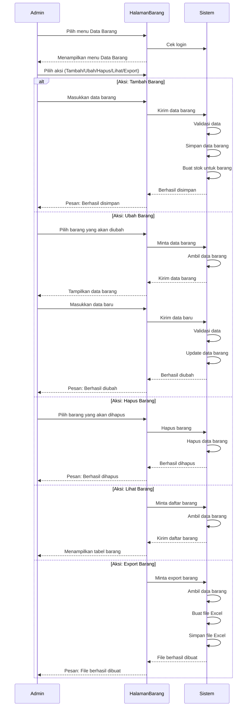

# Sequence Diagram - Data Barang

```mermaid
sequenceDiagram
    participant Admin
    participant HalamanBarang
    participant Sistem

    Admin->>HalamanBarang: Pilih menu Data Barang
    HalamanBarang->>Sistem: Cek login
    HalamanBarang-->>Admin: Menampilkan menu Data Barang
    
    Admin->>HalamanBarang: Pilih aksi (Tambah/Ubah/Hapus/Lihat/Export)
    
    alt Aksi: Tambah Barang
        Admin->>HalamanBarang: Masukkan data barang
        HalamanBarang->>Sistem: Kirim data barang
        Sistem->>Sistem: Validasi data
        Sistem->>Sistem: Simpan data barang
        Sistem->>Sistem: Buat stok untuk barang
        Sistem-->>HalamanBarang: Berhasil disimpan
        HalamanBarang-->>Admin: Pesan: Berhasil disimpan
    
    else Aksi: Ubah Barang
        Admin->>HalamanBarang: Pilih barang yang akan diubah
        HalamanBarang->>Sistem: Minta data barang
        Sistem->>Sistem: Ambil data barang
        Sistem-->>HalamanBarang: Kirim data barang
        HalamanBarang-->>Admin: Tampilkan data barang
        
        Admin->>HalamanBarang: Masukkan data baru
        HalamanBarang->>Sistem: Kirim data baru
        Sistem->>Sistem: Validasi data
        Sistem->>Sistem: Update data barang
        Sistem-->>HalamanBarang: Berhasil diubah
        HalamanBarang-->>Admin: Pesan: Berhasil diubah
    
    else Aksi: Hapus Barang
        Admin->>HalamanBarang: Pilih barang yang akan dihapus
        HalamanBarang->>Sistem: Hapus barang
        Sistem->>Sistem: Hapus data barang
        Sistem-->>HalamanBarang: Berhasil dihapus
        HalamanBarang-->>Admin: Pesan: Berhasil dihapus
    
    else Aksi: Lihat Barang
        HalamanBarang->>Sistem: Minta daftar barang
        Sistem->>Sistem: Ambil data barang
        Sistem-->>HalamanBarang: Kirim daftar barang
        HalamanBarang-->>Admin: Menampilkan tabel barang
    
    else Aksi: Export Barang
        HalamanBarang->>Sistem: Minta export barang
        Sistem->>Sistem: Ambil data barang
        Sistem->>Sistem: Buat file Excel
        Sistem->>Sistem: Simpan file Excel
        Sistem-->>HalamanBarang: File berhasil dibuat
        HalamanBarang-->>Admin: Pesan: File berhasil dibuat
    end
```
