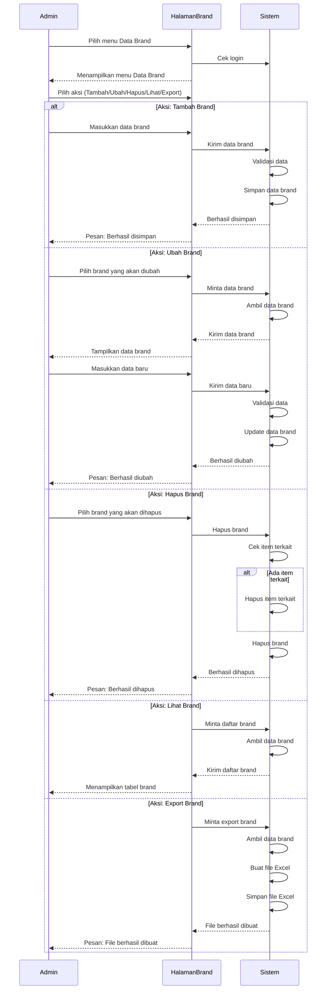

# Sequence Diagram - Data Brand

```mermaid
sequenceDiagram
    participant Admin
    participant HalamanBrand
    participant Sistem

    Admin->>HalamanBrand: Pilih menu Data Brand
    HalamanBrand->>Sistem: Cek login
    HalamanBrand-->>Admin: Menampilkan menu Data Brand
    
    Admin->>HalamanBrand: Pilih aksi (Tambah/Ubah/Hapus/Lihat/Export)
    
    alt Aksi: Tambah Brand
        Admin->>HalamanBrand: Masukkan data brand
        HalamanBrand->>Sistem: Kirim data brand
        Sistem->>Sistem: Validasi data
        Sistem->>Sistem: Simpan data brand
        Sistem-->>HalamanBrand: Berhasil disimpan
        HalamanBrand-->>Admin: Pesan: Berhasil disimpan
    
    else Aksi: Ubah Brand
        Admin->>HalamanBrand: Pilih brand yang akan diubah
        HalamanBrand->>Sistem: Minta data brand
        Sistem->>Sistem: Ambil data brand
        Sistem-->>HalamanBrand: Kirim data brand
        HalamanBrand-->>Admin: Tampilkan data brand
        
        Admin->>HalamanBrand: Masukkan data baru
        HalamanBrand->>Sistem: Kirim data baru
        Sistem->>Sistem: Validasi data
        Sistem->>Sistem: Update data brand
        Sistem-->>HalamanBrand: Berhasil diubah
        HalamanBrand-->>Admin: Pesan: Berhasil diubah
    
    else Aksi: Hapus Brand
        Admin->>HalamanBrand: Pilih brand yang akan dihapus
        HalamanBrand->>Sistem: Hapus brand
        Sistem->>Sistem: Cek item terkait
        
        alt Ada item terkait
            Sistem->>Sistem: Hapus item terkait
        end
        
        Sistem->>Sistem: Hapus brand
        Sistem-->>HalamanBrand: Berhasil dihapus
        HalamanBrand-->>Admin: Pesan: Berhasil dihapus
    
    else Aksi: Lihat Brand
        HalamanBrand->>Sistem: Minta daftar brand
        Sistem->>Sistem: Ambil data brand
        Sistem-->>HalamanBrand: Kirim daftar brand
        HalamanBrand-->>Admin: Menampilkan tabel brand
    
    else Aksi: Export Brand
        HalamanBrand->>Sistem: Minta export brand
        Sistem->>Sistem: Ambil data brand
        Sistem->>Sistem: Buat file Excel
        Sistem->>Sistem: Simpan file Excel
        Sistem-->>HalamanBrand: File berhasil dibuat
        HalamanBrand-->>Admin: Pesan: File berhasil dibuat
    end
```
