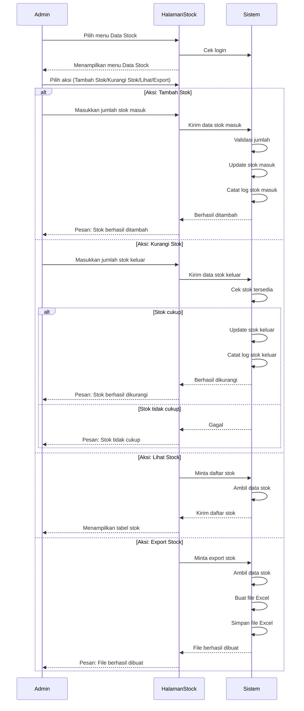

# Sequence Diagram - Data Stock

```mermaid
sequenceDiagram
    participant Admin
    participant HalamanStock
    participant Sistem

    Admin->>HalamanStock: Pilih menu Data Stock
    HalamanStock->>Sistem: Cek login
    HalamanStock-->>Admin: Menampilkan menu Data Stock
    
    Admin->>HalamanStock: Pilih aksi (Tambah Stok/Kurangi Stok/Lihat/Export)
    
    alt Aksi: Tambah Stok
        Admin->>HalamanStock: Masukkan jumlah stok masuk
        HalamanStock->>Sistem: Kirim data stok masuk
        Sistem->>Sistem: Validasi jumlah
        Sistem->>Sistem: Update stok masuk
        Sistem->>Sistem: Catat log stok masuk
        Sistem-->>HalamanStock: Berhasil ditambah
        HalamanStock-->>Admin: Pesan: Stok berhasil ditambah
    
    else Aksi: Kurangi Stok
        Admin->>HalamanStock: Masukkan jumlah stok keluar
        HalamanStock->>Sistem: Kirim data stok keluar
        Sistem->>Sistem: Cek stok tersedia
        
        alt Stok cukup
            Sistem->>Sistem: Update stok keluar
            Sistem->>Sistem: Catat log stok keluar
            Sistem-->>HalamanStock: Berhasil dikurangi
            HalamanStock-->>Admin: Pesan: Stok berhasil dikurangi
        else Stok tidak cukup
            Sistem-->>HalamanStock: Gagal
            HalamanStock-->>Admin: Pesan: Stok tidak cukup
        end
    
    else Aksi: Lihat Stock
        HalamanStock->>Sistem: Minta daftar stok
        Sistem->>Sistem: Ambil data stok
        Sistem-->>HalamanStock: Kirim daftar stok
        HalamanStock-->>Admin: Menampilkan tabel stok
    
    else Aksi: Export Stock
        HalamanStock->>Sistem: Minta export stok
        Sistem->>Sistem: Ambil data stok
        Sistem->>Sistem: Buat file Excel
        Sistem->>Sistem: Simpan file Excel
        Sistem-->>HalamanStock: File berhasil dibuat
        HalamanStock-->>Admin: Pesan: File berhasil dibuat
    end
```
