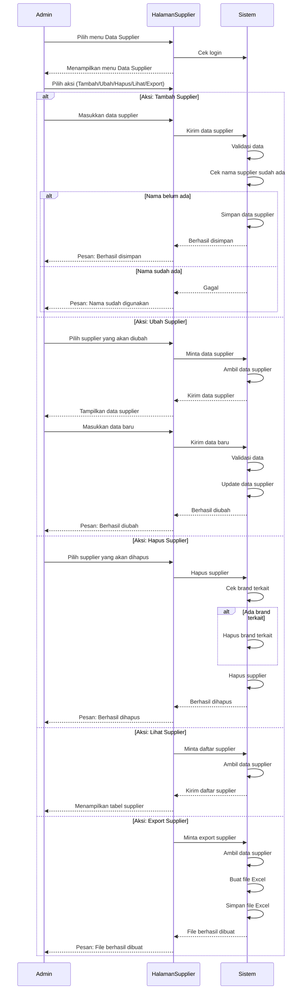

# Sequence Diagram - Data Supplier

```mermaid
sequenceDiagram
    participant Admin
    participant HalamanSupplier
    participant Sistem

    Admin->>HalamanSupplier: Pilih menu Data Supplier
    HalamanSupplier->>Sistem: Cek login
    HalamanSupplier-->>Admin: Menampilkan menu Data Supplier
    
    Admin->>HalamanSupplier: Pilih aksi (Tambah/Ubah/Hapus/Lihat/Export)
    
    alt Aksi: Tambah Supplier
        Admin->>HalamanSupplier: Masukkan data supplier
        HalamanSupplier->>Sistem: Kirim data supplier
        Sistem->>Sistem: Validasi data
        Sistem->>Sistem: Cek nama supplier sudah ada
        
        alt Nama belum ada
            Sistem->>Sistem: Simpan data supplier
            Sistem-->>HalamanSupplier: Berhasil disimpan
            HalamanSupplier-->>Admin: Pesan: Berhasil disimpan
        else Nama sudah ada
            Sistem-->>HalamanSupplier: Gagal
            HalamanSupplier-->>Admin: Pesan: Nama sudah digunakan
        end
    
    else Aksi: Ubah Supplier
        Admin->>HalamanSupplier: Pilih supplier yang akan diubah
        HalamanSupplier->>Sistem: Minta data supplier
        Sistem->>Sistem: Ambil data supplier
        Sistem-->>HalamanSupplier: Kirim data supplier
        HalamanSupplier-->>Admin: Tampilkan data supplier
        
        Admin->>HalamanSupplier: Masukkan data baru
        HalamanSupplier->>Sistem: Kirim data baru
        Sistem->>Sistem: Validasi data
        Sistem->>Sistem: Update data supplier
        Sistem-->>HalamanSupplier: Berhasil diubah
        HalamanSupplier-->>Admin: Pesan: Berhasil diubah
    
    else Aksi: Hapus Supplier
        Admin->>HalamanSupplier: Pilih supplier yang akan dihapus
        HalamanSupplier->>Sistem: Hapus supplier
        Sistem->>Sistem: Cek brand terkait
        
        alt Ada brand terkait
            Sistem->>Sistem: Hapus brand terkait
        end
        
        Sistem->>Sistem: Hapus supplier
        Sistem-->>HalamanSupplier: Berhasil dihapus
        HalamanSupplier-->>Admin: Pesan: Berhasil dihapus
    
    else Aksi: Lihat Supplier
        HalamanSupplier->>Sistem: Minta daftar supplier
        Sistem->>Sistem: Ambil data supplier
        Sistem-->>HalamanSupplier: Kirim daftar supplier
        HalamanSupplier-->>Admin: Menampilkan tabel supplier
    
    else Aksi: Export Supplier
        HalamanSupplier->>Sistem: Minta export supplier
        Sistem->>Sistem: Ambil data supplier
        Sistem->>Sistem: Buat file Excel
        Sistem->>Sistem: Simpan file Excel
        Sistem-->>HalamanSupplier: File berhasil dibuat
        HalamanSupplier-->>Admin: Pesan: File berhasil dibuat
    end
```

