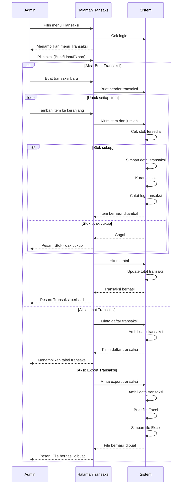

# Sequence Diagram - Data Transaksi Penjualan

```mermaid
sequenceDiagram
    participant Admin
    participant HalamanTransaksi
    participant Sistem

    Admin->>HalamanTransaksi: Pilih menu Transaksi
    HalamanTransaksi->>Sistem: Cek login
    HalamanTransaksi-->>Admin: Menampilkan menu Transaksi
    
    Admin->>HalamanTransaksi: Pilih aksi (Buat/Lihat/Export)
    
    alt Aksi: Buat Transaksi
        Admin->>HalamanTransaksi: Buat transaksi baru
        HalamanTransaksi->>Sistem: Buat header transaksi
        
        loop Untuk setiap item
            Admin->>HalamanTransaksi: Tambah item ke keranjang
            HalamanTransaksi->>Sistem: Kirim item dan jumlah
            Sistem->>Sistem: Cek stok tersedia
            
            alt Stok cukup
                Sistem->>Sistem: Simpan detail transaksi
                Sistem->>Sistem: Kurangi stok
                Sistem->>Sistem: Catat log transaksi
                Sistem-->>HalamanTransaksi: Item berhasil ditambah
            else Stok tidak cukup
                Sistem-->>HalamanTransaksi: Gagal
                HalamanTransaksi-->>Admin: Pesan: Stok tidak cukup
            end
        end
        
        HalamanTransaksi->>Sistem: Hitung total
        Sistem->>Sistem: Update total transaksi
        Sistem-->>HalamanTransaksi: Transaksi berhasil
        HalamanTransaksi-->>Admin: Pesan: Transaksi berhasil
    
    else Aksi: Lihat Transaksi
        HalamanTransaksi->>Sistem: Minta daftar transaksi
        Sistem->>Sistem: Ambil data transaksi
        Sistem-->>HalamanTransaksi: Kirim daftar transaksi
        HalamanTransaksi-->>Admin: Menampilkan tabel transaksi
    
    else Aksi: Export Transaksi
        HalamanTransaksi->>Sistem: Minta export transaksi
        Sistem->>Sistem: Ambil data transaksi
        Sistem->>Sistem: Buat file Excel
        Sistem->>Sistem: Simpan file Excel
        Sistem-->>HalamanTransaksi: File berhasil dibuat
        HalamanTransaksi-->>Admin: Pesan: File berhasil dibuat
    end
```
