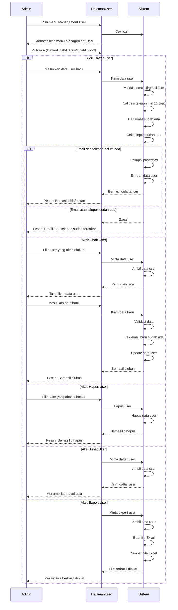

# Sequence Diagram - Management User

```mermaid
sequenceDiagram
    participant Admin
    participant HalamanUser
    participant Sistem

    Admin->>HalamanUser: Pilih menu Management User
    HalamanUser->>Sistem: Cek login
    HalamanUser-->>Admin: Menampilkan menu Management User
    
    Admin->>HalamanUser: Pilih aksi (Daftar/Ubah/Hapus/Lihat/Export)
    
    alt Aksi: Daftar User
        Admin->>HalamanUser: Masukkan data user baru
        HalamanUser->>Sistem: Kirim data user
        Sistem->>Sistem: Validasi email @gmail.com
        Sistem->>Sistem: Validasi telepon min 11 digit
        Sistem->>Sistem: Cek email sudah ada
        Sistem->>Sistem: Cek telepon sudah ada
        
        alt Email dan telepon belum ada
            Sistem->>Sistem: Enkripsi password
            Sistem->>Sistem: Simpan data user
            Sistem-->>HalamanUser: Berhasil didaftarkan
            HalamanUser-->>Admin: Pesan: Berhasil didaftarkan
        else Email atau telepon sudah ada
            Sistem-->>HalamanUser: Gagal
            HalamanUser-->>Admin: Pesan: Email atau telepon sudah terdaftar
        end
    
    else Aksi: Ubah User
        Admin->>HalamanUser: Pilih user yang akan diubah
        HalamanUser->>Sistem: Minta data user
        Sistem->>Sistem: Ambil data user
        Sistem-->>HalamanUser: Kirim data user
        HalamanUser-->>Admin: Tampilkan data user
        
        Admin->>HalamanUser: Masukkan data baru
        HalamanUser->>Sistem: Kirim data baru
        Sistem->>Sistem: Validasi data
        Sistem->>Sistem: Cek email baru sudah ada
        Sistem->>Sistem: Update data user
        Sistem-->>HalamanUser: Berhasil diubah
        HalamanUser-->>Admin: Pesan: Berhasil diubah
    
    else Aksi: Hapus User
        Admin->>HalamanUser: Pilih user yang akan dihapus
        HalamanUser->>Sistem: Hapus user
        Sistem->>Sistem: Hapus data user
        Sistem-->>HalamanUser: Berhasil dihapus
        HalamanUser-->>Admin: Pesan: Berhasil dihapus
    
    else Aksi: Lihat User
        HalamanUser->>Sistem: Minta daftar user
        Sistem->>Sistem: Ambil data user
        Sistem-->>HalamanUser: Kirim daftar user
        HalamanUser-->>Admin: Menampilkan tabel user
    
    else Aksi: Export User
        HalamanUser->>Sistem: Minta export user
        Sistem->>Sistem: Ambil data user
        Sistem->>Sistem: Buat file Excel
        Sistem->>Sistem: Simpan file Excel
        Sistem-->>HalamanUser: File berhasil dibuat
        HalamanUser-->>Admin: Pesan: File berhasil dibuat
    end
```
