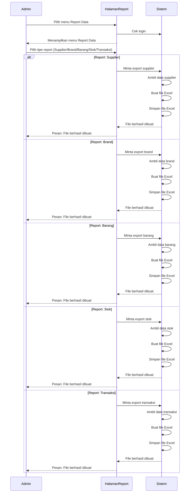

# Sequence Diagram - Report Data

```mermaid
sequenceDiagram
    participant Admin
    participant HalamanReport
    participant Sistem

    Admin->>HalamanReport: Pilih menu Report Data
    HalamanReport->>Sistem: Cek login
    HalamanReport-->>Admin: Menampilkan menu Report Data
    
    Admin->>HalamanReport: Pilih tipe report (Supplier/Brand/Barang/Stok/Transaksi)
    
    alt Report: Supplier
        HalamanReport->>Sistem: Minta export supplier
        Sistem->>Sistem: Ambil data supplier
        Sistem->>Sistem: Buat file Excel
        Sistem->>Sistem: Simpan file Excel
        Sistem-->>HalamanReport: File berhasil dibuat
        HalamanReport-->>Admin: Pesan: File berhasil dibuat
    
    else Report: Brand
        HalamanReport->>Sistem: Minta export brand
        Sistem->>Sistem: Ambil data brand
        Sistem->>Sistem: Buat file Excel
        Sistem->>Sistem: Simpan file Excel
        Sistem-->>HalamanReport: File berhasil dibuat
        HalamanReport-->>Admin: Pesan: File berhasil dibuat
    
    else Report: Barang
        HalamanReport->>Sistem: Minta export barang
        Sistem->>Sistem: Ambil data barang
        Sistem->>Sistem: Buat file Excel
        Sistem->>Sistem: Simpan file Excel
        Sistem-->>HalamanReport: File berhasil dibuat
        HalamanReport-->>Admin: Pesan: File berhasil dibuat
    
    else Report: Stok
        HalamanReport->>Sistem: Minta export stok
        Sistem->>Sistem: Ambil data stok
        Sistem->>Sistem: Buat file Excel
        Sistem->>Sistem: Simpan file Excel
        Sistem-->>HalamanReport: File berhasil dibuat
        HalamanReport-->>Admin: Pesan: File berhasil dibuat
    
    else Report: Transaksi
        HalamanReport->>Sistem: Minta export transaksi
        Sistem->>Sistem: Ambil data transaksi
        Sistem->>Sistem: Buat file Excel
        Sistem->>Sistem: Simpan file Excel
        Sistem-->>HalamanReport: File berhasil dibuat
        HalamanReport-->>Admin: Pesan: File berhasil dibuat
    end
```
