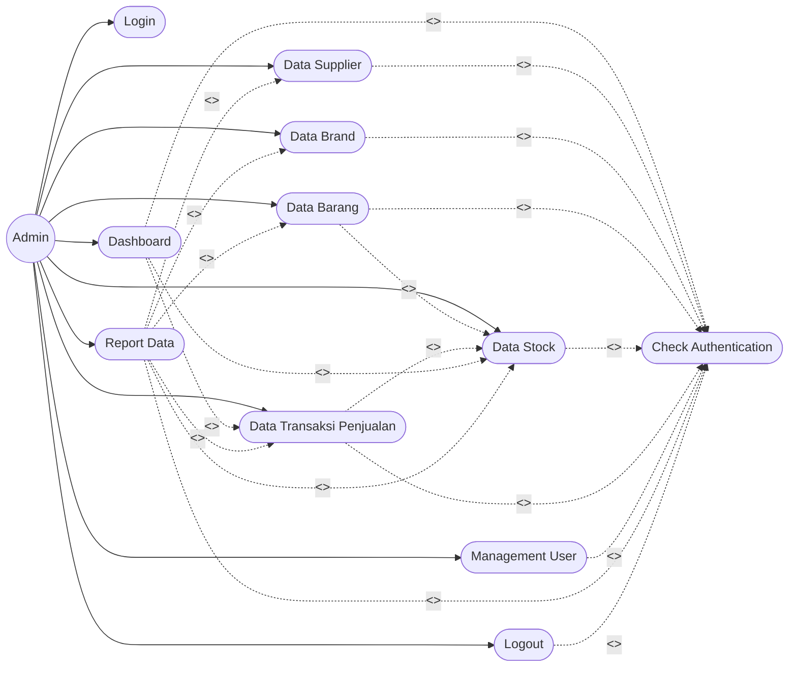

# Use Case Diagram - Sistem Inventory Roxy

## Penjelasan Singkat

### Include (<<include>>)
- **Check Authentication** wajib dilakukan sebelum akses semua fitur (kecuali Login)
- Semua use case di atas Login memerlukan autentikasi terlebih dahulu

### Extend (<<extend>>)
- **Data Barang** → **Data Stock**: Membuat barang baru otomatis membuat stock
- **Data Transaksi** → **Data Stock**: Transaksi mengurangi stock
- **Dashboard** → Menampilkan data Stock dan Transaksi
- **Report Data** → Dapat membuat laporan dari berbagai data

